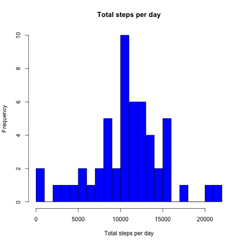
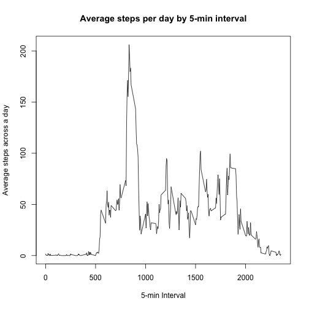
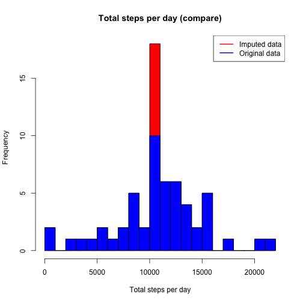
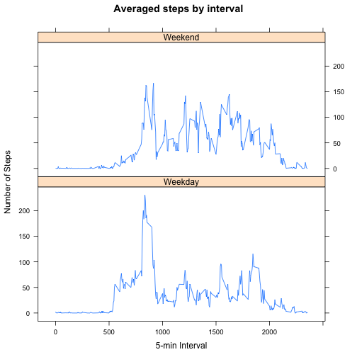

Reproducible research: Course project 1
=======================================
**Date** *: 03.04.2017*

## Introduction
This assignment makes use of data from a personal activity monitoring device. This device collects data at 5 minute intervals through out the day. The data consists of two months of data from an anonymous individual collected during the months of October and November, 2012 and include the number of steps taken in 5 minute intervals each day.

The data for this assignment can be downloaded from the course web site [Activity monitoring data][1] :

[1]:https://d396qusza40orc.cloudfront.net/repdata%2Fdata%2Factivity.zip /"Activity monitoring data"

The variables included in this dataset are:

- **steps**: Number of steps taking in a 5-minute interval (missing values are coded as 𝙽𝙰)

- **date**: The date on which the measurement was taken in YYYY-MM-DD format

- **interval**: Identifier for the 5-minute interval in which measurement was taken

The dataset is stored in a comma-separated-value (CSV) file and there are a total of 17,568 observations in this dataset.

##  Load library

```r
library(dplyr)
library(magrittr)
library(lattice)
```

## Loading and processing the data
 1. Unzip downloaded file and load it into data frame 'data'

```r
Adata <- read.csv(unz("repdata%2Fdata%2Factivity.zip", "activity.csv"))
head(Adata)
```

```
##   steps       date interval
## 1    NA 2012-10-01        0
## 2    NA 2012-10-01        5
## 3    NA 2012-10-01       10
## 4    NA 2012-10-01       15
## 5    NA 2012-10-01       20
## 6    NA 2012-10-01       25
```

 2. Process/transform the data (if necessary) into a format suitable for your analysis


## What is mean total number of steps taken per day?
* For this part of the assignment, you can ignore the missing values in the dataset.

1. Calculate the total number of steps taken per day

```r
TotalStep <- aggregate(steps ~ date, data=Adata, FUN=sum, na.rm=T)
head(TotalStep)
```

```
##         date steps
## 1 2012-10-02   126
## 2 2012-10-03 11352
## 3 2012-10-04 12116
## 4 2012-10-05 13294
## 5 2012-10-06 15420
## 6 2012-10-07 11015
```

2. Make a histogram of the total number of steps taken each day

```r
hist(TotalStep$steps,main= "Total steps per day", xlab="Total steps per day", col="blue", breaks=20)
```



3. Calculate and report the mean and median of the total number of steps taken per day

```r
# Mean of the total number of steps
MeanSteps <- mean(TotalStep$steps, na.rm=T)
MeanSteps
```

```
## [1] 10766.19
```


```r
# Median of the total number of steps
MedianSteps <- median(TotalStep$steps, na.rm=T)
MedianSteps
```

```
## [1] 10765
```
Mean and median of the total number of steps taken per day are: 10766.19 and 10765 respectively. 

# What is the average daily activity pattern?

1. Make a time series plot (i.e. 𝚝𝚢𝚙𝚎 = "𝚕") of the 5-minute interval (x-axis) and the average number of steps taken, averaged across all days (y-axis)

```r
# calculate average steps
IntervalStep <- aggregate(steps ~ interval, Adata, mean)
# make a plot
plot(IntervalStep$interval, IntervalStep$steps, type='l', main="Average steps per day by 5-min interval", xlab="5-min Interval", ylab="Average steps across a day")
```



2. Which 5-minute interval, on average across all the days in the dataset, contains the maximum number of steps?

```r
IntervalStep[which.max(IntervalStep$steps),1]
```

```
## [1] 835
```
With 5-min interval, on average across all the days in the dataset, the 835th of '5-min' contains the maximum number of steps.

## Imputing missing values
Note that there are a number of days/intervals where there are missing values (coded as 𝙽𝙰). The presence of missing days may introduce bias into some calculations or summaries of the data.

1. Calculate and report the total number of missing values in the dataset (i.e. the total number of rows with 𝙽𝙰s)

```r
sum(is.na(Adata$steps))
```

```
## [1] 2304
```
The total number of missing values in the dataset is 2304.

2. Devise a strategy for filling in all of the missing values in the dataset. The strategy does not need to be sophisticated. For example, you could use the mean/median for that day, or the mean for that 5-minute interval, etc.

Propose to use the average steps that locates in the same 5-min interval to replace the 'NA'. 

3. Create a new dataset that is equal to the original dataset but with the missing data filled in.

```r
NewData <- Adata
NAs <- is.na(NewData$steps)
IntervalStep<- tapply(NewData$steps, NewData$interval, mean, na.rm=TRUE, simplify = TRUE)
NewData$steps[NAs] <- IntervalStep[as.character(NewData$interval[NAs])]
head(NewData)
```

```
##       steps       date interval
## 1 1.7169811 2012-10-01        0
## 2 0.3396226 2012-10-01        5
## 3 0.1320755 2012-10-01       10
## 4 0.1509434 2012-10-01       15
## 5 0.0754717 2012-10-01       20
## 6 2.0943396 2012-10-01       25
```

4. Make a histogram of the total number of steps taken each day and Calculate and report the mean and median total number of steps taken per day. Do these values differ from the estimates from the first part of the assignment? What is the impact of imputing missing data on the estimates of the total daily number of steps?

```r
TotalStep2 <- aggregate(steps ~ date, data=NewData, FUN=sum, na.rm=T)

hist(TotalStep2$steps,main= "Total steps per day (compare)", xlab="Total steps per day", col="red", breaks=20)

hist(TotalStep$steps,main= "Total steps per day (compare)", xlab="Total steps per day", col="blue", breaks=20, add= T)
legend("topright",c("Imputed data", "Original data"),col=c("red", "blue"), lwd=2)
```




```r
# Mean of the total number of steps (new dataset)
MeanSteps <- mean(TotalStep$steps, na.rm=T)
MeanSteps
```

```
## [1] 10766.19
```

```r
# Median of the total number of steps (new dataset)
MedianSteps <- median(TotalStep$steps, na.rm=T)
MedianSteps
```

```
## [1] 10765
```

```r
# Differece between the two datasets total steps
diff <- sum(TotalStep2$steps)-sum(TotalStep$steps)
diff
```

```
## [1] 86129.51
```

```r
# find out the date that contains the maximal steps.
TotalStep[which.max(TotalStep$steps),1] # original data set
```

```
## [1] "2012-11-23"
```

```r
TotalStep2[which.max(TotalStep2$steps),1] # imputed data set
```

```
## [1] "2012-11-23"
```
With applying the proposed strategy, there is no difference on the mean and median of the total number of steps taken per day. While due to using averaged value instead of NA, the total step number increased 86130 steps in the New data set. And there is no impact on the date that contains the maximal steps in the day.

# Are there differences in activity patterns between weekdays and weekends?
For this part the 𝚠𝚎𝚎𝚔𝚍𝚊𝚢𝚜() function may be of some help here. Use the dataset with the filled-in missing values for this part.

1. Create a new factor variable in the dataset with two levels – “weekday” and “weekend” indicating whether a given date is a weekday or weekend day.

```r
NewData <- NewData %>%
  mutate(dayType= ifelse(weekdays(NewData$date)=="Saturday" | weekdays(NewData$date)=="Sunday","Weekend","Weekday"))
head(NewData)
```

```
##       steps       date interval dayType
## 1 1.7169811 2012-10-01        0 Weekday
## 2 0.3396226 2012-10-01        5 Weekday
## 3 0.1320755 2012-10-01       10 Weekday
## 4 0.1509434 2012-10-01       15 Weekday
## 5 0.0754717 2012-10-01       20 Weekday
## 6 2.0943396 2012-10-01       25 Weekday
```

2. Make a panel plot containing a time series plot (i.e. 𝚝𝚢𝚙𝚎 = "𝚕") of the 5-minute interval (x-axis) and the average number of steps taken, averaged across all weekday days or weekend days (y-axis). See the README file in the GitHub repository to see an example of what this plot should look like using simulated data.

```r
IntervalStep2 <- aggregate(steps ~ interval+dayType, NewData, mean)
head(IntervalStep2)
```

```
##   interval dayType      steps
## 1        0 Weekday 2.25115304
## 2        5 Weekday 0.44528302
## 3       10 Weekday 0.17316562
## 4       15 Weekday 0.19790356
## 5       20 Weekday 0.09895178
## 6       25 Weekday 1.59035639
```

```r
xyplot(IntervalStep2$steps ~ IntervalStep2$interval | IntervalStep2$dayType, layout=c(1,2), type='l', main="Averaged steps by interval", xlab="5-min Interval", ylab="Number of Steps")
```



